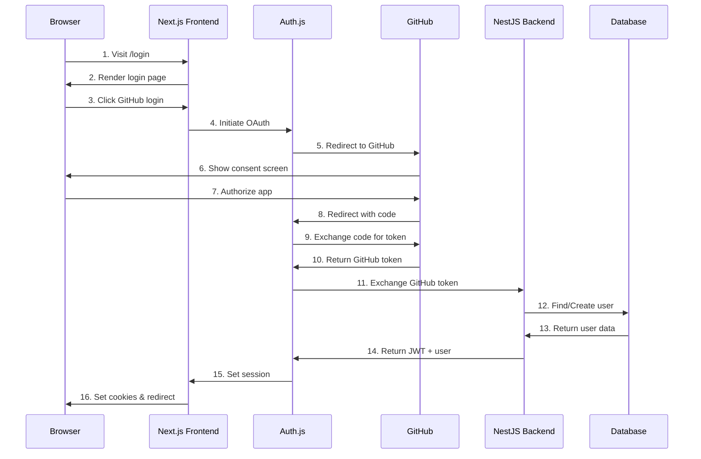
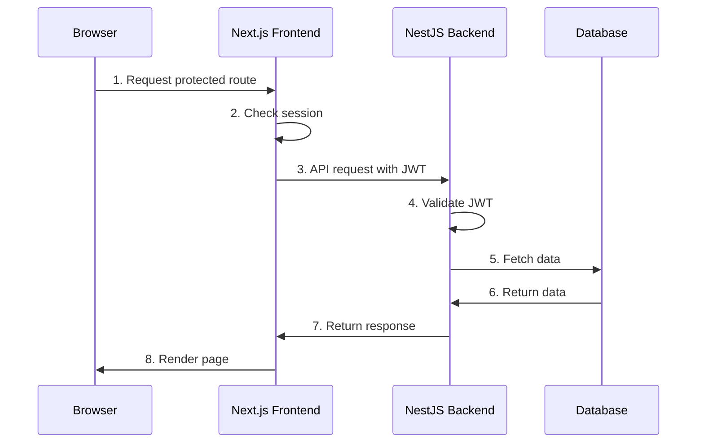
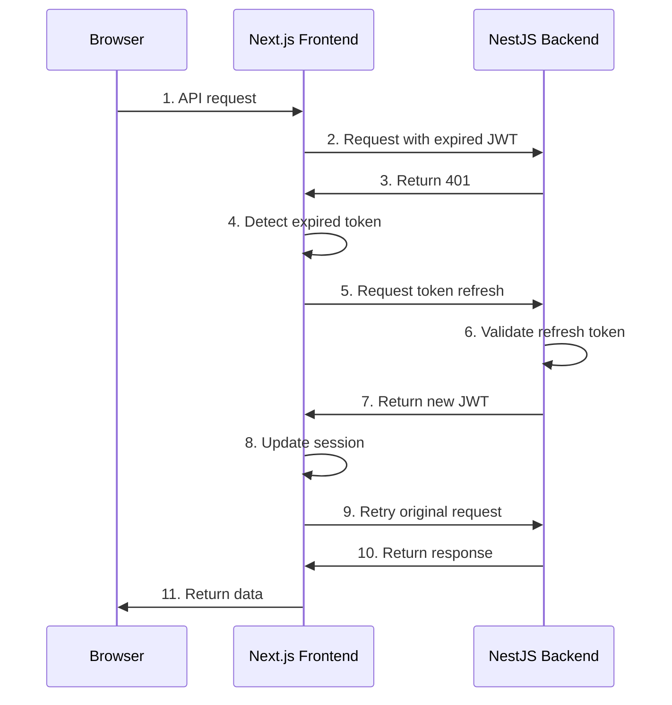
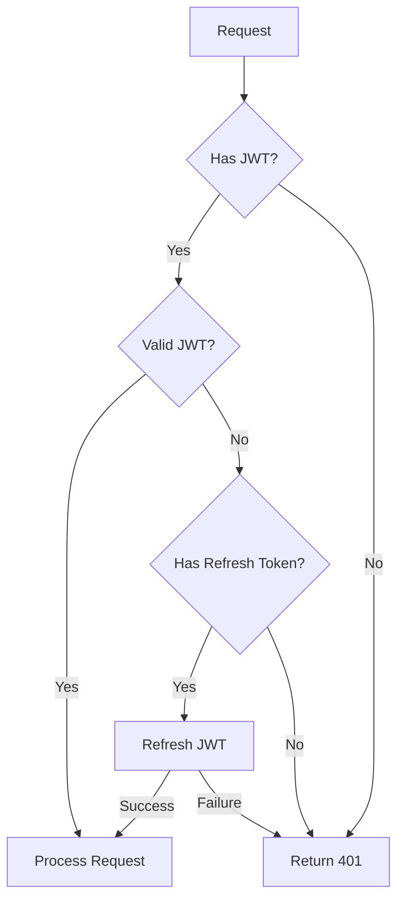

# Authentication Flow

## Overview

This document details the authentication flow between the browser, Next.js frontend server, NestJS backend server, and GitHub OAuth provider. The system uses a combination of OAuth 2.0 and JWT tokens to provide secure authentication.

## Components

1. **Browser (Client)**

   - Initiates authentication
   - Stores cookies
   - Makes API requests

2. **Next.js Frontend**

   - Handles OAuth flow with Auth.js
   - Manages sessions
   - Communicates with backend

3. **NestJS Backend**

   - Validates tokens
   - Issues JWTs
   - Manages user data

4. **GitHub OAuth**
   - External authentication provider

## Authentication Flows

### 1. Initial Login Flow



### 2. API Request Flow



### 3. Token Refresh Flow



## Token Management

### JWT Structure

```typescript
interface JWTPayload {
  sub: string; // User ID
  email: string; // User email
  name: string; // User name
  iat: number; // Issued at
  exp: number; // Expiration time
  jti: string; // JWT ID
}
```

### Session Cookie Structure

```typescript
interface SessionCookie {
  user: {
    id: string;
    email: string;
    name: string;
  };
  accessToken: string;
  refreshToken: string;
  expires: string;
}
```

## Security Measures

### 1. Token Security

- Access tokens expire after 15 minutes
- Refresh tokens expire after 7 days
- Tokens are stored in HTTP-only cookies
- CSRF protection enabled
- Secure and SameSite cookie attributes

### 2. Request Security



### 3. CSRF Protection

```typescript
// CSRF Token Generation
const csrfToken = crypto.randomBytes(32).toString('hex');

// Request Validation
app.use(
  csurf({
    cookie: {
      httpOnly: true,
      sameSite: 'strict',
    },
  }),
);
```

## Error Handling

### Common Authentication Errors

1. **Invalid Token**

```json
{
  "statusCode": 401,
  "message": "Invalid token",
  "error": "Unauthorized"
}
```

2. **Token Expired**

```json
{
  "statusCode": 401,
  "message": "Token expired",
  "error": "Unauthorized"
}
```

3. **Invalid Refresh Token**

```json
{
  "statusCode": 401,
  "message": "Invalid refresh token",
  "error": "Unauthorized"
}
```

## Implementation Details

### 1. Frontend Authentication Guard

```typescript
// apps/web/middleware.ts
export async function middleware(request: NextRequest) {
  // Check for valid session
  const session = await getSession(request);

  if (!session) {
    return NextResponse.redirect('/login');
  }

  // Validate JWT
  if (isTokenExpired(session.accessToken)) {
    // Attempt refresh
    const newToken = await refreshToken(session.refreshToken);
    if (!newToken) {
      return NextResponse.redirect('/login');
    }
  }

  return NextResponse.next();
}
```

### 2. Backend JWT Strategy

```typescript
// apps/api/src/auth/jwt.strategy.ts
@Injectable()
export class JwtStrategy extends PassportStrategy(Strategy) {
  constructor() {
    super({
      jwtFromRequest: ExtractJwt.fromAuthHeaderAsBearerToken(),
      secretOrKey: process.env.JWT_SECRET,
      ignoreExpiration: false,
    });
  }

  async validate(payload: JWTPayload) {
    return {
      userId: payload.sub,
      email: payload.email,
      name: payload.name,
    };
  }
}
```

## Testing Authentication

### 1. Unit Tests

```typescript
describe('AuthService', () => {
  it('should validate JWT token', async () => {
    const token = await service.createToken(user);
    const validated = await service.validateToken(token);
    expect(validated).toBeDefined();
    expect(validated.sub).toBe(user.id);
  });
});
```

### 2. Integration Tests

```typescript
describe('Auth Flow', () => {
  it('should complete GitHub OAuth flow', async () => {
    const response = await request(app)
      .post('/auth/github')
      .send({ code: 'test-code' });

    expect(response.status).toBe(200);
    expect(response.body.accessToken).toBeDefined();
  });
});
```

## Debugging Authentication

### Common Issues and Solutions

1. **Session Not Persisting**

   - Check cookie settings
   - Verify domain configuration
   - Ensure HTTPS in production

2. **Token Refresh Failing**

   - Check token expiration
   - Verify refresh token storage
   - Validate backend endpoints

3. **CORS Issues**
   - Configure allowed origins
   - Check credential settings
   - Verify request headers
