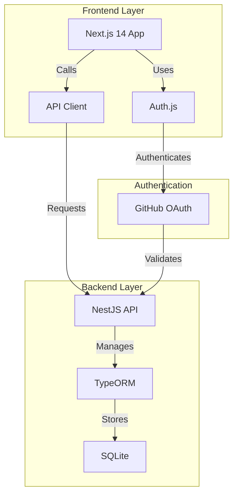

# Introduction

## Overview

This project is a secure full-stack application template that demonstrates modern authentication practices using GitHub OAuth. Built with Next.js 14 and NestJS 10, it provides a robust foundation for developing secure web applications.

## Key Features

- **Secure Authentication**: GitHub OAuth integration with JWT token management
- **Modern Stack**: Next.js 14 frontend with NestJS 10 backend
- **Type Safety**: Full TypeScript support across the entire stack
- **Database Integration**: SQLite with TypeORM for data persistence
- **Monorepo Structure**: Organized using Turborepo for optimal development experience

## Architecture Overview

The application follows a modern microservices architecture with clear separation of concerns:



## Technical Stack

### Frontend

- Next.js 14 with App Router
- Auth.js for authentication
- Material-UI for components
- TypeScript for type safety

### Backend

- NestJS 10 framework
- TypeORM for database operations
- SQLite for data storage
- Passport.js for authentication

### Development Tools

- Turborepo for monorepo management
- ESLint for code quality
- Prettier for code formatting
- Jest for testing

## Project Structure

```
├── apps/
│   ├── web/           # Next.js frontend
│   └── api/           # NestJS backend
├── packages/
│   ├── config/        # Shared configuration
│   ├── shared/        # Shared types and utilities
│   └── storage/       # Database entities and migrations
└── docs/             # Documentation
```

## Next Steps

- Check out the [Getting Started](./getting-started) guide to set up your development environment
- Review the [API Documentation](../api) for available endpoints
- Learn about the [Authentication Flow](../auth/flow) in detail
